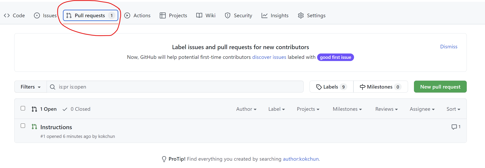

# git-branches

Vi lägger till första raden och committar

## instructions branch

Nu skapar vi en branch som heter instructions. Detta gör vi mha kommandot 

```md
git checkout -b instructions
```

För att pusha upp ändringar till denna branch behöver vi först stage, commit och pusha. För push till denna branch gör vi 

```md
git push origin instructions
```

För att checka branches som vi har: 

```md
git branch
```

---
## Pull request

För att få mergea in ändringar från denna branch in till main så öppnar vi en pull request. Detta gör vi i fliken pull request.




